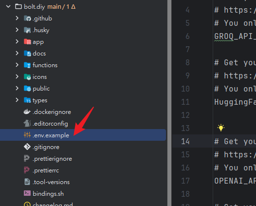

# 使用docker 啟動環境

> https://stackblitz-labs.github.io/bolt.diy/

```shell
# 將 .env.example 重命名為 .env.local 
# 並添加您的 LLM API 密鑰。您可以在 Mac 上的 “[your name]/bolt.diy/.env.example” 中找到此檔。
# 對於 Windows 和 Linux，路徑將相似。


# 安裝 docker image
npm run dockerbuild


```





## 使用 development profile，對代碼的更改將自動反映在正在運行的容器中（熱重載）。

```shell
docker-compose --profile development up 
```


## 使用 production profile

```shell

# 192.168.1.114 host.docker.internal
# 192.168.1.114 gateway.docker.internal


docker-compose --profile production up 
```
